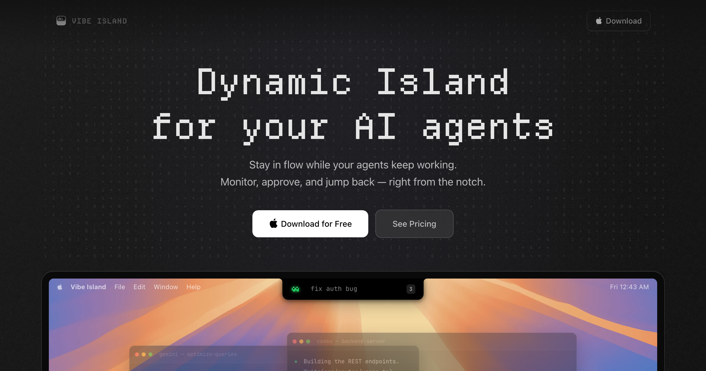
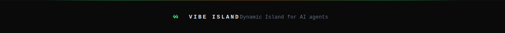

<h1 align="center">Vibe Island</h1>

<p align="center">
  <b>A Dynamic Island for your AI coding tools.</b><br/>
  <sub>Monitor sessions · Approve permissions · Jump to terminal · Sound effects · Zero config</sub>
</p>

<p align="center">
  
  
  
  
  
  <a href="LICENSE"></a>
</p>

<p align="center">
  
  
  
  
  
  
  
</p>

---

## What is Vibe Island?

<p align="center">
  
</p>

A floating notch panel that sits at the top of your screen and monitors all your AI coding sessions — Claude Code, Codex, Gemini, Cursor, and more. See which agents are running, approve permissions without switching windows, and jump to the exact terminal tab with one click.

<table>
<tr>
<td width="50%">

### The Problem

You're running 4 AI agents across different terminals. One needs permission approval. Another finished 10 minutes ago. You're constantly switching windows to check on them.

**That's 15 hours a week in context switches.**

</td>
<td width="50%">

### The Solution

A single floating pill at the top of your screen shows everything at a glance:

- 🟠 Claude is working on `auth-module`
- 🟢 Codex is idle
- 🟣 Gemini needs permission to run `rm -rf /tmp`
- 🔵 Cursor is writing tests

**Approve, deny, or jump — without leaving your flow.**

</td>
</tr>
</table>

---

## Features

<table>
<tr>
<td width="33%" align="center">

### 👁️ Session Monitoring

See all active AI coding sessions in a compact pill. Status indicators show what each agent is doing right now.

</td>
<td width="33%" align="center">

### 🔐 Permission Approval

Approve or deny tool use directly from the floating panel. Supports held connections — the AI tool waits for your decision.

</td>
<td width="33%" align="center">

### 🎯 Jump to Terminal

Click any session to jump to the exact terminal tab, tmux pane, or IDE window where it's running.

</td>
</tr>
<tr>
<td width="33%" align="center">

### 🔊 Sound Effects

Audible notifications when agents need attention. Custom sound packs via the PeonPing registry.

</td>
<td width="33%" align="center">

### ⌨️ Global Shortcuts

Keyboard shortcuts for approve-all, deny-all, toggle panel, and bypass permissions.

</td>
<td width="33%" align="center">

### 🔧 Zero Config

Auto-detects and installs hooks for all supported AI tools on first launch. No manual setup needed.

</td>
</tr>
</table>

---

## Supported Tools

| Tool | Integration | Hook Type | Status |
|------|-------------|-----------|--------|
|  | Full (sessions, permissions, questions) | Python hook | ✅ |
|  | Full (sessions, permissions, app-server) | Python hook | ✅ |
|  | Full (sessions, permissions) | Python hook | ✅ |
|  | Full (sessions, permissions) | Python hook | ✅ |
|  | Full (sessions, permissions, questions) | JS plugin | ✅ |
|  | Basic (session monitoring) | URI handler | ✅ |
|  | Basic (session monitoring) | Config injection | ✅ |
|  | Basic (session monitoring) | Config injection | ✅ |
|  | Basic (session monitoring) | Config injection | ✅ |

---

## Platform Support

<table>
<tr>
<td width="25%" align="center">

### 

Native notch-aware positioning. Floats above all windows. System tray integration. `.dmg` installer.

</td>
<td width="25%" align="center">

### 

Always-on-top floating panel. Named pipe IPC. System tray. `.msi` and `.exe` installers.

</td>
<td width="25%" align="center">

### 

X11 dock-type window. Always-on-top. AppIndicator tray. `.deb`, `.rpm`, `.AppImage`.

</td>
<td width="25%" align="center">

### 

Auto-applies window rules via `hyprctl`. Pinned, floating, borderless. Native Wayland.

</td>
</tr>
</table>

### Hyprland Integration

Vibe Island auto-applies window rules via `hyprctl` on startup. You can also add them to `~/.config/hypr/hyprland.conf`:

```ini
# Vibe Island — Dynamic Island panel
windowrulev2 = float, class:^(vibe-island)$
windowrulev2 = pin, class:^(vibe-island)$
windowrulev2 = noborder, class:^(vibe-island)$
windowrulev2 = noshadow, class:^(vibe-island)$
windowrulev2 = noanim, class:^(vibe-island)$
windowrulev2 = move 33% 0, class:^(vibe-island)$
```

---

## Quick Start

### Install

```bash
# Clone
git clone https://github.com/VoidChecksum/vibe-island.git
cd vibe-island

# Install dependencies
npm install  # or bun install

# Build
npx tauri build
```

### Platform Dependencies

<details>
<summary><b>Linux (Debian/Ubuntu)</b></summary>

```bash
sudo apt install libwebkit2gtk-4.1-dev build-essential curl wget file \
  libxdo-dev libssl-dev libayatana-appindicator3-dev librsvg2-dev libasound2-dev
```

</details>

<details>
<summary><b>Linux (Arch)</b></summary>

```bash
sudo pacman -S webkit2gtk-4.1 base-devel curl wget file libxdotool \
  openssl libayatana-appindicator librsvg alsa-lib
```

</details>

<details>
<summary><b>macOS</b></summary>

```bash
xcode-select --install
```

</details>

<details>
<summary><b>Windows</b></summary>

Install [Visual Studio Build Tools](https://visualstudio.microsoft.com/visual-cpp-build-tools/) with "Desktop development with C++" workload. WebView2 is included in Windows 10/11.

</details>

### Development

```bash
# Dev mode with hot reload
npx tauri dev

# The notch panel appears at the top of your screen
# Hook scripts are auto-installed on first launch
```

### Build Output

| Platform | Output |
|----------|--------|
| macOS | `src-tauri/target/release/bundle/dmg/Vibe Island.dmg` |
| Windows | `src-tauri/target/release/bundle/msi/Vibe Island.msi` |
| Linux | `src-tauri/target/release/bundle/deb/vibe-island.deb` |
| Linux | `src-tauri/target/release/bundle/appimage/vibe-island.AppImage` |

---

## Architecture

```
┌─────────────────────────────────────────────────────────────────┐
│                         Vibe Island                              │
├─────────────────────────┬───────────────────────────────────────┤
│     Rust Backend        │         React Frontend                │
│                         │                                       │
│  ┌─────────────────┐    │    ┌──────────────────────┐           │
│  │  SocketServer   │    │    │    NotchPanel         │           │
│  │  /tmp/vibe-     │◄───┼───►│    ├─ SessionRow      │           │
│  │  island.sock    │    │    │    ├─ ApprovalCard     │           │
│  └────────┬────────┘    │    │    └─ QuestionPrompt   │           │
│           │             │    └──────────────────────┘           │
│  ┌────────▼────────┐    │    ┌──────────────────────┐           │
│  │  SessionStore   │    │    │    SettingsPanel      │           │
│  │  (Arc<Mutex>)   │────┼───►│    └─ Platform info    │           │
│  └────────┬────────┘    │    └──────────────────────┘           │
│           │             │                                       │
│  ┌────────▼────────┐    │    ┌──────────────────────┐           │
│  │  HookInstaller  │    │    │    OnboardingScreen   │           │
│  │  Claude/Codex/  │    │    │    └─ Hook setup       │           │
│  │  Gemini/Cursor  │    │    └──────────────────────┘           │
│  └─────────────────┘    │                                       │
│  ┌─────────────────┐    │    State: Zustand                     │
│  │  SoundManager   │    │    IPC: Tauri events + commands       │
│  │  (rodio)        │    │    UI: Tailwind + Framer Motion       │
│  └─────────────────┘    │                                       │
│  ┌─────────────────┐    │                                       │
│  │  Platform       │    │                                       │
│  │  macOS/Win/     │    │                                       │
│  │  Linux/Hyprland │    │                                       │
│  └─────────────────┘    │                                       │
├─────────────────────────┴───────────────────────────────────────┤
│  Communication: Hook scripts → Unix socket → Tauri IPC → React  │
└─────────────────────────────────────────────────────────────────┘
```

### Data Flow

```
AI Tool ─── hook.py ─── /tmp/vibe-island.sock ─── SessionStore ─── React UI
                        (named pipe on Windows)        │
                                                       ▼
                                              Tauri emit("session-update")
```

### Event Types

| Event | Direction | Description |
|-------|-----------|-------------|
| `SessionStart` | Hook → App | New AI coding session started |
| `SessionEnd` | Hook → App | Session terminated |
| `UserPromptSubmit` | Hook → App | User sent a prompt |
| `PreToolUse` | Hook → App | Tool about to execute |
| `PostToolUse` | Hook → App | Tool execution completed |
| `PermissionRequest` | Hook ↔ App | Tool needs approval (held connection) |
| `Stop` | Hook → App | Session went idle |

---

## Project Structure

```
vibe-island/
├── assets/                 SVG banners and graphics
├── src-tauri/              Rust backend (Tauri v2)
│   ├── src/
│   │   ├── lib.rs              App entry, Tauri commands
│   │   ├── main.rs             Binary entry point
│   │   ├── sessions/mod.rs     Session state machine + models
│   │   ├── socket/mod.rs       Unix socket / named pipe server
│   │   ├── hooks/mod.rs        Hook installer (5 tools, 4 scripts)
│   │   ├── config/mod.rs       Persistent configuration
│   │   ├── sound/mod.rs        Audio playback (rodio, cross-platform)
│   │   └── platform/mod.rs     OS-specific (macOS/Win/Linux/Hyprland)
│   ├── icons/                  App icons (all sizes)
│   └── Cargo.toml              Rust dependencies
├── src/                    React frontend
│   ├── App.tsx                 Root component
│   ├── main.tsx                Entry point
│   ├── components/
│   │   ├── notch/
│   │   │   ├── NotchPanel.tsx      The Dynamic Island panel
│   │   │   └── SessionRow.tsx      Per-session row with status
│   │   ├── approval/
│   │   │   └── ApprovalCard.tsx    Permission approval UI
│   │   ├── settings/
│   │   │   └── SettingsPanel.tsx   Full settings interface
│   │   └── onboarding/
│   │       └── OnboardingScreen.tsx First-run setup
│   ├── store/useStore.ts       Zustand state management
│   ├── types/index.ts          TypeScript types + constants
│   └── styles/index.css        Tailwind CSS
├── package.json
├── tailwind.config.js
├── vite.config.ts
└── tsconfig.json
```

---

## Configuration

Settings are stored in `~/.config/vibe-island/config.json`:

```json
{
  "display": { "position": "top-center", "opacity": 0.95 },
  "layout": { "style": "clean", "show_tool_names": true },
  "shortcuts": {
    "toggle_panel": "CmdOrCtrl+Shift+V",
    "approve_all": "CmdOrCtrl+Shift+A"
  },
  "sound": { "enabled": true, "volume": 0.5, "pack": "default" },
  "monitored_tools": ["claude", "codex", "gemini", "cursor", "opencode"]
}
```

---

## Tech Stack

| Layer | Technology | Why |
|-------|-----------|-----|
| Backend | **Rust** + Tauri v2 | ~5MB binary, native performance, cross-platform |
| Frontend | **React 19** + TypeScript | Component model, ecosystem, DX |
| Styling | **Tailwind CSS** + Framer Motion | Utility-first, smooth animations |
| State | **Zustand** | Lightweight, no boilerplate |
| Audio | **rodio** (Rust) | Cross-platform audio, pure Rust |
| IPC | **Unix socket** / Named pipe | Same protocol as original, zero overhead |
| Build | **Vite** + Cargo | Fast HMR, incremental Rust builds |

---

## Contributing

```bash
# Fork & clone
git clone https://github.com/YOUR_USERNAME/vibe-island.git

# Install deps
npm install
cargo check --manifest-path src-tauri/Cargo.toml

# Dev mode
npx tauri dev

# Run TypeScript checks
npx tsc --noEmit
```

---

<p align="center">
  <picture>
    <source media="(prefers-color-scheme: dark)" srcset="assets/footer.svg" />
    <source media="(prefers-color-scheme: light)" srcset="assets/footer.svg" />
    
  </picture>
</p>

<p align="center">
  <sub>Made with ☕ by <a href="https://github.com/VoidChecksum">VoidChecksum</a> · <a href="https://github.com/VoidChecksum/vibe-island/issues">Report Bug</a> · <a href="https://github.com/VoidChecksum/vibe-island/issues">Request Feature</a></sub>
</p>
